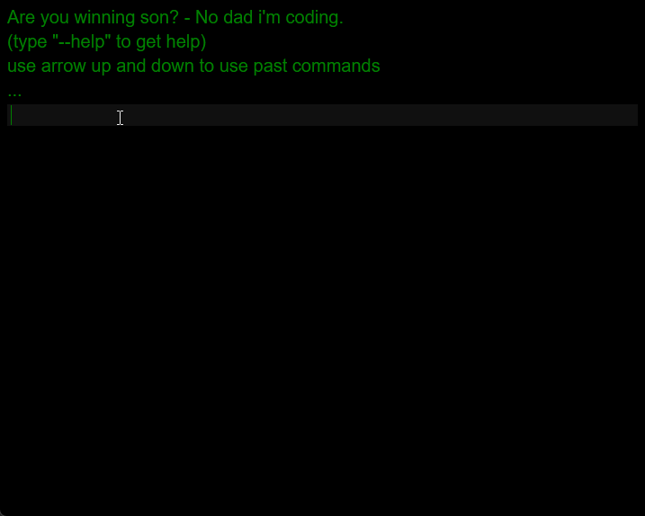

# Console App

This is fullstack app that can store and operate with cars database via client console.
<br>
<br>
<b>Lang</b>: Typescript.
<br>
<b>Techies</b>: React, Express, MongoDB, Docker.
<br>
<b>Reqs</b>: Node.js version 18, Docker.
<br>
* you can use <b>NVM</b> if your nodejs version is not 18:
https://nodejs.org/en/download/package-manager/
<hr>

#### How to start local:

1) `git clone`
2) `docker run --name mongo6 -d -p 27017:27017 mongo:6.0.3`
3) `npm i` from be and fe folder.
4) `npm run-script start` from fe and be folder.
5) open http://localhost:3000 in browser.
* you can use docker compose to run app:
```
docker-compose --profile dev up
```

#### App listen ports in dev by default:
1) font end:  3000.
2) back end:  3001.
3) mongodb: 27017. <i>(27117 in docker)</i>

## Demo
